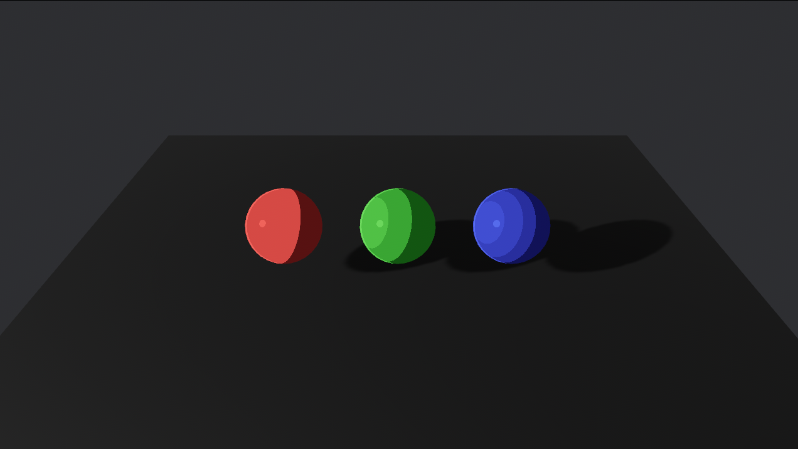

# What is this?

A toon shader that can easily be applied to any model for a stylized look similar to Windwaker or Breath of the Wild for the [bevy](https://bevyengine.org/) game engine.

## Getting Started
```
cargo add bevy_toon_material
```

```rs
use bevy::prelude::*;
use bevy_toon_material::*;

fn main() {
    App::new()
        .add_plugins(DefaultPlugins)
        .add_plugins(ToonShaderPlugin)
        .add_systems(Startup, setup)
        .run();
}

fn setup(
    mut cmd: Commands,
    mut meshes: ResMut<Assets<Mesh>>,
    mut toon: ResMut<Assets<ToonShader>>,
) {
    // spawn camera with the ToonCamera Component
    cmd.spawn((
        Camera3d::default(),
        Camera {
            hdr: true,
            ..default()
        },
        Transform::from_xyz(0.0, 40.0, 60.0).looking_at(Vec3::ZERO, Vec3::Y),
        ToonCamera,
    ));

    let toon_mat = toon.add(ToonShader::default());

    // spawn a sphere and apply the material
    cmd.spawn((
        Mesh3d(meshes.add(Sphere::new(5.0))),
        MeshMaterial3d(toon_mat.clone()),
        Transform::from_xyz(0.0, 0.0, 0.0),
    ));

    // spawn directional light with a ToonLight component
    cmd.spawn((
        DirectionalLight {
            shadows_enabled: true,
            ..default()
        },
        Transform::from_xyz(-20.0, 10.0, 10.0).looking_at(Vec3::ZERO, Vec3::Y),
        ToonLight,
    ));

}
```

## Running examples
```
git clone https://github.com/AndrewDanial/bevy_toon_material.git
cd bevy_toon_material
cargo run --example example_file_name
```

## Features
- Toon shading
- Specular highlighting
- Rim effects
- Banding

## Todo List
- Support for existing textures on models
- Add more examples
- Shadow receiving
- Support for multiple light sources

## Credit
- An existing toon shader implementation that is unfortunately a little out of date: [bevy_toon_shader](https://github.com/tbillington/bevy_toon_shader)
- An easily-to-follow toon shader tutorial for the Unity game engine: https://roystan.net/articles/toon-shader/

## Bevy version support

| Bevy | bevy_toon_material |
|---|---|
| 0.15 | 0.1 |

